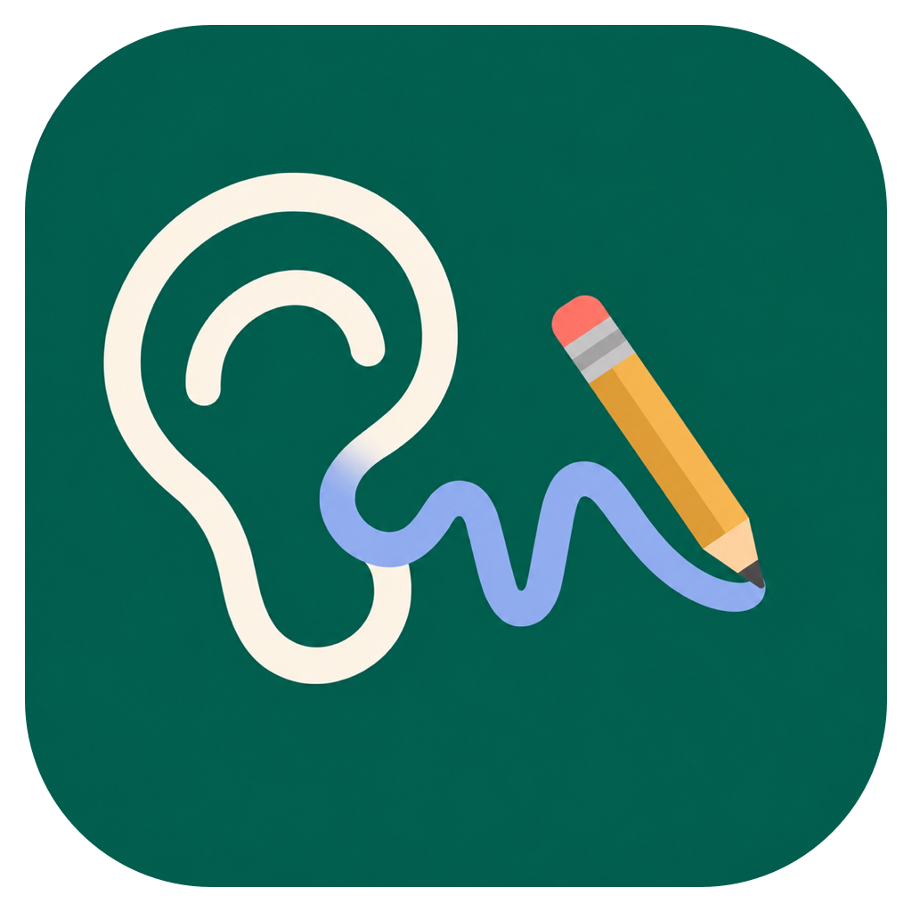

<p align="center">
  
</p>

# ListenUp

Mac에서 강의와 회의를 녹음하고 OpenAI API로 전사·요약하는 앱입니다.

## 주요 기능

- 마이크와 선택한 앱의 소리를 함께 또는 따로 녹음
- 녹음 중 이전 구간 다시 듣기 및 기존 오디오 가져오기
- 회의·강의에 맞춘 한국어 전사와 요약
- 전사와 요약을 Markdown으로 복사·저장
- 필요한 경우에만 결과물을 ZIP으로 내보내기

## 요구 사항

- Apple Silicon Mac
- macOS 15 이상
- OpenAI API 키

## 설치

[GitHub Releases](https://github.com/stich9208/listenup/releases)의 Assets에서 `ListenUp-0.2.0-arm64-unsigned.dmg`를 내려받아 `ListenUp.app`을 Applications 폴더로 옮깁니다.

현재 베타는 서명·공증되지 않았습니다. 처음 실행이 차단되면 **시스템 설정 → 개인정보 보호 및 보안 → 그래도 열기**를 선택하세요. 자세한 내용은 [베타 설치 안내](docs/UNSIGNED_INSTALL.md)를 참고하세요.

## 사용 방법

1. 설정에서 OpenAI API 키와 결과 저장 폴더를 지정합니다.
2. 녹음 제목·용도·대상을 선택하고 녹음을 시작합니다.
3. 녹음을 마친 뒤 OpenAI 처리를 실행합니다.
4. 전사와 요약을 확인하거나 **결과물 내보내기**를 선택합니다.

내보낸 ZIP에는 다음 두 파일만 포함됩니다.

- `recording.m4a`
- `transcript-summary.html` — 오디오 재생, 요약, 전체 전사

세션 정보, 내부 JSON, 로그, API 요청·응답 및 API 키는 결과물에 포함되지 않습니다.

## 소스에서 실행

```sh
./scripts/build-app.sh Release
open dist/ListenUp.app
```

OpenAI API 키는 macOS 키체인에 저장됩니다. 전사할 오디오와 요약할 텍스트만 OpenAI API로 전송됩니다.
