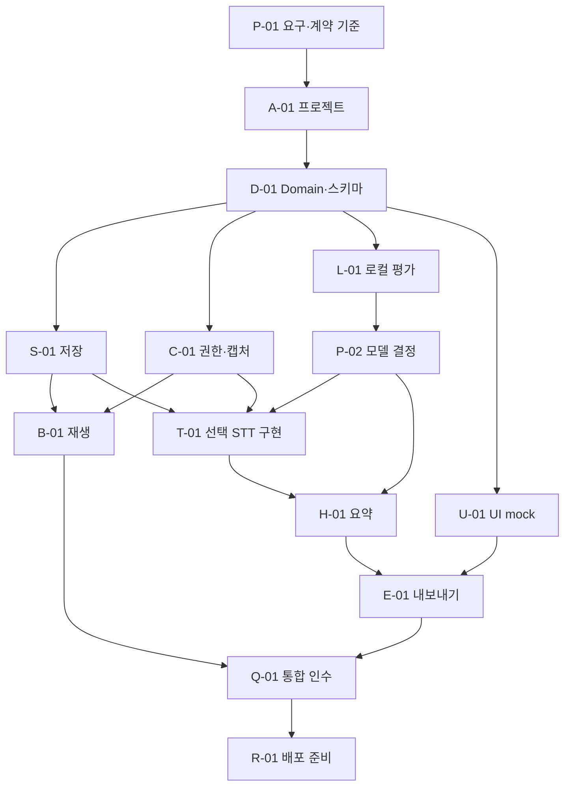

# 에이전트용 구현 TODO

> 2026-09-09 변경: 로컬 모델 관련 완료 항목은 결정 기록으로 남긴다. 현재 API 전환 구현과 검증 기준은 [OpenAI API 전환 문서](OPENAI_API_MIGRATION.md)를 우선한다.

2026-09-09 · 상태: **네이티브 앱 수직 흐름 구현, 통합 검증 진행 중**. 아래 목록과 `docs/work-orders/`를 실행 계약으로 사용한다.

선행 문서: [PRD](PRD.md), [기술 설계](TECHNICAL_DESIGN.md), [모델·비용](MODEL_SELECTION.md), [현재 Mac과 로컬 모델](LOCAL_MODELS_AND_HARDWARE.md).

사용자 확인: 강의·회의 모두 사용. 현재 Mac은 M1 Pro 16GiB. WhisperKit 전사와 Qwen3 4B MLX 4bit 요약을 로컬 기본 경로로 구현한다. 모델 설치·로컬 STT·로컬 요약은 P0다. 8B와 클라우드 경로는 MVP에서 제외한다.

### 2026-09-09 구현·검증 현황

| 구분 | 현재 증거 | 판정 |
| --- | --- | --- |
| 앱 빌드 | Xcode Release 앱, MLX `default.metallib`, resource bundle 포함, ad-hoc 서명·Info.plist 검사 통과 | 구현·자동 검사 완료 |
| Domain·저장·오디오·AI·Export | Swift package 전체 28개 테스트 통과(11 XCTest + 17 Swift Testing), 독립 Astra Low 정적 회귀 검수 | 자동 검증 완료 |
| 로컬 모델 | 고정 manifest 2,910,072,539 bytes SHA-256 확인. 합성 한국어 음성 Whisper 전사와 Qwen MLX 로딩·생성 실행 | 짧은 통합 smoke 완료; 실제 품질·장시간 성능 판정 아님 |
| 실제 녹음 UI | 앱 산출물은 생성됨. UI 자동화 도구가 ScreenCaptureKit 오류로 열지 못함 | 마이크·선택 앱 권한, 녹음, 동시 재생을 사람이 실기기에서 확인해야 함 |
| 사용자 결과 흐름 | 가져오기·세션 열기·처리·Markdown/클립보드 코드와 테스트 | 실제 Notion 테스트 페이지 붙여넣기와 2시간 세션은 미검증 |

체크박스는 아래 원래 수용 계약을 보존한다. 구현 코드가 있어도 실기기·장시간 조건이 남은 항목은 완료로 바꾸지 않는다.

## 1. 에이전트 배치와 파일 소유권

향후 구현을 병렬로 맡길 때의 역할 설계다. 실제 동시 실행 수는 사용 가능한 슬롯에 맞추며 보통 통합 담당 1명+작업 담당 2~3명으로 시작한다. 하나의 파일은 한 담당자만 편집한다.

| 역할 | 소유 영역 | 책임 |
| --- | --- | --- |
| 통합 담당 | 앱 project 파일, Package.swift, Domain, 공용 fixture 계약, docs | 인터페이스 확정, 작업 배치, 의존성 통합, 최종 인수 |
| 오디오 담당 | Sources/AudioCapture, AudioProcessing, Playback, 해당 Tests | 캡처·시간축·재생·입력 장애 |
| 저장 담당 | Sources/Storage, 해당 Tests | manifest·journal·리비전·복구·폴더 접근 |
| AI 담당 | Sources/Transcription, Summarization, ModelRuntime, 해당 Tests, Benchmarks | 공급자·로컬 모델·전사·요약·평가 |
| UI/내보내기 담당 | App/Features, Sources/Export, UI Tests | 녹음 화면·결과·편집·복사 |

역할은 다섯 개지만 동시에 다섯 에이전트를 실행할 필요는 없다. 저장 완료 후 같은 슬롯을 UI 담당으로 바꿀 수 있다. 공용 계약을 수정해야 하면 통합 담당에게 필드·이유·영향을 전달하고, 승인된 계약 변경 후 각 담당이 자신의 영역을 수정한다. 같은 프로젝트 파일을 여러 담당이 동시에 편집하지 않는다.

기존 `.serena/` 등 사용자·환경 파일은 범위 밖이다. 브랜치를 만들면 기본 `codex/` 접두사를 사용한다. 커밋·PR·배포 여부는 후속 구현 요청 범위를 따른다.

## 2. 작업 완료의 정의

체크박스는 코드가 존재한다는 이유만으로 완료하지 않는다. 각 작업의 지정 검증을 통과하고, 산출물 경로·수행 명령·결과·남은 제한을 기록해야 완료다. 실제 OS 시험과 API 시험이 필요한 항목을 mock 통과로 대체하지 않는다.

구현 작업 시작 시 해당 저장소 AGENTS.md와 RTK 지침을 따른다. API 키를 로그·테스트 fixture·저장소에 넣지 않는다. 실제 음성 없이도 합성 신호와 비식별 mock 응답으로 대부분의 파이프라인을 검증한다.

작업 보고 형식:

```text
작업 ID / 상태
변경 경로:
구현한 동작:
실행한 검증과 결과:
실기기·API에서 아직 확인하지 못한 내용:
공용 계약 변경 필요 여부:
다음 담당자가 사용할 인터페이스·fixture:
```

## 3. 의존성과 진행 순서



실제 순서는 다음 게이트로 운영한다.

- G0: Domain·파일 schema·시간축·에러 계약 확정. 각 기능이 mock 기반으로 병렬 구현 가능.
- G1: 실제 Mac에서 녹음→파일→다시 듣기 확인. 모델 작업과 별도로 진행.
- G2: 선택된 로컬 전사의 가중치·옵션과 요약 모델을 평가 후 고정.
- G3: 녹음/파일→전사→요약→복사 수직 흐름 통과.
- G4: 장애·장시간·한국어 품질·노션 시험 통과.
- G5: 서명·설치 검증 완료 시 배포 가능한 MVP. 자가 개발 실행은 배포와 별도 판정.

## 4. P·A·D: 기준·프로젝트·공용 계약

### [ ] P-01 — 요구사항·평가 계획 동결

담당: 통합 · 의존: 없음 · 크기: S

PRD의 FR ID와 이 문서의 작업을 확인한다. 사용 환경·월 사용 시간·외부 전송 가능 여부·화자 구분 필요도를 기록한다. Mac 사양은 이번 확인값으로 시작하고 실제 실행 시점에 다시 확인한다. 자료가 없는 성능 수치는 목표로 남긴다.

완료: 결정 로그에 확정/가정/미결이 구분되고 미결 모델 때문에 녹음 구현을 막지 않음. 이번 문서 작성 완료를 이 구현 체크박스 완료로 간주하지 않음.

### [ ] A-01 — 네이티브 프로젝트 및 빌드

담당: 통합 · 의존: P-01 · 크기: M

macOS 앱 타깃과 테스트 가능한 코어 패키지를 생성한다. Swift/Xcode 버전, 최소 macOS 15, bundle ID, 샌드박스 전략을 고정한다. 앱·코어 test scheme과 .gitignore를 작성한다. 모델 파일·원음·API 키·DerivedData는 저장소에서 제외한다.

완료: 깨끗한 checkout에서 문서화된 build/test 명령으로 앱 실행과 코어 테스트 성공. `xcodebuild -list`로 실제 scheme을 확인하여 존재하지 않는 명령을 README에 쓰지 않음.

### [ ] D-01 — Domain·파일 schema·fixture 확정

담당: 통합 · 의존: A-01 · 크기: M

Session, AudioSpan, Gap, TranscriptSegment/Revision, Annotation, SummaryRevision, UsageRecord와 오류 enum을 구현한다. JSON schema v1, fixture 세션, mock STT·요약을 추가한다. 타입은 Codable/Sendable 계약을 갖고 앱 상태에 OS 객체를 직접 저장하지 않는다.

완료: 왕복 직렬화, 잘못된 범위·참조·schema version 거부, 마이그레이션 필요 상태, nullable 시각·화자 처리 테스트 통과. 기술문서 예시와 실제 schema 차이가 없음.

### [ ] P-02 — 로컬 모델 설정·요약 모델 고정

담당: 통합+AI · 의존: L-01 · 크기: S

로컬 결과를 사용자에게 제시하고 최종 기본 조합을 기록한다. 클라우드 비교는 외부 전송이 선택된 경우에만 수행한다. 확정할 항목은 STT ID, 요약 ID, 가중치 revision, 옵션, 화자 기능, 처리 위치, 허용 지연, 비용 한도다.

완료: 실제 측정과 선호에 근거한 결론, 실행하지 않은 후보 명시. 이후 T/H 작업은 선택된 조합만 P0로 구현. 사용자 결정 대기 중에는 저장·오디오·mock UI 작업 지속 가능.

## 5. S: 저장·복구

### [ ] S-01 — 폴더 선택·세션 생성·단일 writer

담당: 저장 · 의존: D-01 · 크기: M

사용자 지정 루트, 세션 디렉터리, 상대 경로, 유효한 파일명, session lock, SessionStore actor를 구현한다. 샌드박스 사용 시 security-scoped bookmark 생명주기를 구현한다.

완료: 동일 제목 연속 생성, 두 앱 인스턴스 충돌, 경로 탈출, stale bookmark, 읽기 전용 폴더 테스트. 선택 폴더가 없으면 녹음 시작 전 해결 동작 제공.

### [ ] S-02 — journal·원자 커밋·복구

담당: 저장 · 의존: S-01 · 크기: L

불변 산출물→journal→manifest checkpoint 순서와 원자 교체를 구현한다. 마지막 JSONL 행 잘림, orphan 파일, checksum 불일치, `.partial` 오디오를 처리한다.

완료: 각 커밋 단계에 fault injection 후 정상 확정된 결과가 남음. 같은 event를 다시 replay해도 이중 적용되지 않음. 복구 불가능 부분은 Gap이며 ‘완료’로 숨기지 않음.

### [ ] S-03 — 폴더 재열기·리비전·외부 수정 보존

담당: 저장 · 의존: S-02 · 크기: M

세션 이동 후 열기, 누락 오디오가 있는 텍스트 열람, 교정 리비전, export 충돌 사본을 구현한다. 모델·캐시는 세션 이동에 필수 데이터가 아니어야 한다.

완료: Finder 폴더 이름 변경·이동 후 열람, 외부 수정 md 비파괴 보존, 구버전/손상 manifest의 설명 가능한 오류, 이전 요약 복원 통과.

## 6. C·B: 녹음·오디오·다시 듣기

### [ ] C-01 — OS 권한·입력 소스 spike

담당: 오디오 · 의존: D-01 · 크기: M

마이크 전용, 선택 앱 시스템 오디오, 둘 모두를 30초씩 캡처한다. macOS 15 availability, 현재 OS의 실제 권한 흐름, 앱 필터, 장치 선택을 검증한다. 실제 대상 강의/회의 앱이 아직 미정이면 Safari/Chrome 미디어와 사용 가능한 회의 앱부터 호환성 표를 만든다.

완료: 소스별 실제 WAV/CAF와 시간·레벨 증거. 권한 거부·앱 종료 동작 기록. 탭 격리와 앱 격리를 구분. 실패하면 Core Audio 대안 spike 필요 여부를 통합 담당에게 보고.

### [ ] C-02 — 제한된 큐·5초 파일·연속성

담당: 오디오 · 의존: C-01, S-01 · 크기: L

오디오 callback과 writer를 분리하고 5초 PCM 조각을 확정한다. 시스템·마이크 원본 트랙, frame counter, 시간 anchor, Gap을 저장한다. 모든 파일 등록은 SessionStore 계약을 사용한다.

완료: 10분 합성 신호의 저장 프레임과 시간 mapping 일치, 큐 포화 강제 주입 시 Gap 발생, 부분 파일을 재생기가 읽지 않음. 저장 중 HTTP 작업 없음.

### [ ] C-03 — 정렬·믹싱·파일 가져오기

담당: 오디오 · 의존: C-02 · 크기: M

단일 STT 입력용 mono 혼합 사본과 AudioSpan mapping을 만든다. sample rate 변환, 초기 오프셋·누락 보존, clip 방지를 검증한다. m4a/mp3/wav는 원본 복사 후 디코드한다.

완료: 두 트랙 테스트 펄스 상대 오차 ≤100ms 목표, 44.1k/48k 변환, 손상/무음/불지원 파일 오류, 원본 미변경. 장시간 파일을 전부 RAM에 적재하지 않음.

### [ ] C-04 — 일시정지·절전·장치 변경·디스크 오류

담당: 오디오+저장(각자 소유 파일) · 의존: C-02, S-02 · 크기: L

정지 경계와 마지막 조각 확정, 장치 변경 재구성, 권한 철회·절전·디스크 부족 중단을 구현한다. 새 녹음이 필요할 때 로컬 추론에 캡처 우선권을 적용한다.

완료: Bluetooth 이탈·권한 철회·강제 종료·디스크 실패·일시정지 중 종료를 시험. 원본 손실·중단 시각을 사용자에게 표시하고 이미 확정된 파일이 유지됨.

### [ ] B-01 — 녹음 중 파일 기반 다시 듣기

담당: 오디오 · 의존: C-02, S-01 · 크기: L

독립 recordingHead/playhead, 15초 뒤로, 임의 탐색, 재생 정지, 실시간 위치 복귀를 구현한다. `excludesCurrentProcessAudio`를 설정하고 확정 구간만 재생한다.

완료: 10분 녹음 중 과거 30초를 3회 재생해도 캡처 길이·연속성이 유지. 앱 재생이 시스템 트랙에 다시 들어가지 않는 실제 loopback 시험. 이어폰과 스피커+마이크 결과를 구별하여 기록.

### [ ] B-02 — 반복 제외·북마크·개인 메모

담당: UI/내보내기 · 의존: D-01, S-01, B-01 · 크기: M

replayRange annotation, 경계 수정·해제, 교정 텍스트 선택 제외, 북마크·메모를 구현한다. 구간과 전사 precision을 연결하고 부분 겹침에는 미리보기를 제공한다.

완료: 외부 강의 30초 되감기가 전체 전사에는 남고 확인한 요약 입력에서만 빠짐. 정상 반복·정정 발언을 자동 삭제하지 않음. 제외 해제 후 요약 stale이 됨.

## 7. L: 로컬 모델 평가와 조건부 구현

### [ ] L-01 — 현재 Mac에서 로컬 적합성 평가 (모델 결정의 선행 작업)

담당: AI · 의존: A-01, P-01 · 크기: M

사용 가능한 한국어 강의·회의 각 10분을 준비한 뒤 WhisperKit 압축 모델과 Qwen3 4B를 순차 평가한다. 8B를 자동 다운로드하지 않는다. 다운로드 전 모델 ID·크기·저장 위치를 명시한다. 사용자 자료가 없으면 허가된 공개 샘플로 시작하고 한계를 기록한다.

완료: `Benchmarks/local-evaluation.md`와 측정 JSON에 모델 revision, 입력 checksum, CER·개체 정확도, 요약 근거성, cold/warm 시간, RTF, peak RSS, memory pressure, 사용 Mac/OS 기록. ‘실측 없음’을 임의의 성능 숫자로 채우지 않음. 원본 민감 자료는 repo 밖에 보관.

### [ ] L-02 — 앱 내 별도 모델 다운로드·버전 관리 (P0 확정)

담당: AI · 의존: P-02, S-01 · 크기: M

모델 카탈로그·revision·checksum·license·파일 크기, 다운로드/재개/취소/검증/삭제, 사용자 모델 폴더를 구현한다. 안정 런타임 버전을 고정한다.

모델 가중치를 앱 설치 파일에서 제외한다. 최초 실행의 ‘모두 받기/모델별 다운로드/나중에’, 모델 관리 화면, 모델별 설치 상태와 기능 활성화를 구현한다. 기본은 Application Support의 모델 전용 폴더이며 녹음 폴더와 분리한다. 전사 모델만 설치한 상태에서는 전사까지 가능하고 요약은 대기한다.

검증 항목 추가: 앱 종료 후 재개, Range 미지원 서버의 부분 파일 재시작 안내, ETag 변경, 로드 검증 실패, 동일 모델 다운로드 중복 방지, 모델 삭제 후 결과 파일 보존, 앱 업데이트 후 기존 모델 재사용. 앱 서명 대상 내부 파일을 다운로드로 변경하지 않음을 확인한다. UI 소유 파일은 UI 담당과 나눠 작업한다.

완료: 다운로드 끊김·부분 파일·디스크 부족·checksum 실패·모델 폴더 이동 시험. 설치 전 녹음 가능, 후처리 대기. 모델을 세션마다 중복 복사하지 않음. 업데이트 실패 시 이전 모델 유지.

### [ ] L-03 — 로컬 STT·요약 adapter와 메모리 관리 (로컬 선택 시 P0)

담당: AI · 의존: L-02, T-01, H-01 · 크기: L

WhisperKit과 MLX Swift LM을 기존 provider 계약에 연결한다. STT 종료 후 모델 해제, 요약 4~6K 입력 청크, 최대 출력 제한, 취소·memory pressure 대응·캡처 우선권을 구현한다. 클라우드와 다른 context 예산을 설정한다.

완료: 전사·요약 순차 처리가 저장 리비전·근거 계약을 만족. 메모리 예산 초과 시 청크 축소/작업 일시정지, 자동 클라우드 전송 없음. 모델 로드 실패가 녹음을 막지 않음.

### [ ] L-04 — 완전 오프라인 인수 (완전 로컬 선택 시 P0)

담당: 통합+AI · 의존: L-03, E-01 · 크기: M

모델 설치 후 네트워크를 끄고 파일→STT→요약→복사→재열기 전체 흐름을 시험한다. 네트워크 요청 추적에서 음성·전사 전송을 확인한다.

완료: 외부 처리 요청 0건, API 키 없이 성공. 원격 토크나이저/가중치 의존이 남지 않음. 종료 후 로컬 처리 지연·품질·자원 결과 기록.

## 8. T: 전사와 사용량

### [ ] T-01 — 공급자 capability·작업 큐·mock

담당: AI · 의존: D-01, S-01 · 크기: M

STTProvider, request plan, configHash, 응답 정규화, mock을 구현한다. `processingLocation`을 local/cloud로 구분하고 초기 queue 동시성은 cloud=2/local=1로 둔다.

완료: 지원하지 않는 prompt/timestamp 옵션이 발송되지 않음. 모델별 timestamp 정밀도·nullable confidence 보존. mock으로 성공·역순 완료·부분 실패 테스트.

### [ ] T-02 — 선택된 클라우드 STT adapter (클라우드 선택 시 P0)

담당: AI · 의존: P-02, T-01 · 크기: M

선택한 공급자 하나의 HTTP 요청, 인증, timeout, 응답 제한, 모델 접근 오류를 구현한다. API 키 저장은 Keychain abstraction으로 연결한다. 인증 키를 fixtures에 포함하지 않는다.

완료: HTTP stub 계약 테스트. 사용자에게 허용된 실제 짧은 음성으로 smoke test 후 request ID·시간·비용 기록. 허용 전에는 live test 미수행을 명시.

### [ ] T-03 — 청크·coverage·진행률

담당: AI · 의존: T-01, C-03, S-02 · 크기: L

60초/최대65초 경계 계획, byte limit, 입력 mapping, 강제 분할 상태, 응답 정렬을 구현한다. 공급자 로컬 처리에는 업로드를 요구하지 않는 파일 경로 입력을 사용한다.

완료: 청크 사이 누락·중복 없는 coverage, 시작·끝 단어 fixture, 25MB 초과 생성 방지, 2시간 입력의 제한 메모리 사용. 실패 구간이 있으면 partial 표시.

### [ ] T-04 — 재시도·취소·복구·예상액

담당: AI · 의존: T-03, S-02 · 크기: M

시도별 usage ledger, 가격 snapshot, 예약액, 응답 재사용, backoff, unknown timeout을 구현한다. 로컬 완료 중복 제거와 공급자 청구를 구분한다.

완료: 429·5xx·401·timeout·취소·재시작 시험. 완료 청크 재발송 없음, 불명확한 요청은 불명확 표시, 한도 도달 시 새 요청만 보류. 원본은 보존.

## 9. H: 목적별 요약

### [ ] H-01 — 요약 provider·프롬프트·스키마

담당: AI · 의존: D-01 · 크기: M

강의/회의별 입력·출력 schema와 버전 관리 prompt를 구현한다. mock으로 생성·검증을 확인하고 선택된 실제 adapter는 P-02 뒤 연결한다. 로컬 adapter는 L-03, 클라우드 adapter는 H-04에서 구현한다.

완료: 같은 전사에서 강의·회의 출력 구조가 다름. 담당자/기한 null, 학습 질문 generated 표시, 사용자 메모 구별. 전사 속 악성 지시를 실행하는 도구 기능 없음.

### [ ] H-02 — 부분 추출·종합·근거 검증

담당: AI · 의존: H-01, T-03 · 크기: L

provider별 토큰 예산, map/reduce, 모든 대상 구간 coverage, evidence ID 보존, 형식 오류·잘린 출력 재처리를 구현한다. 의미적 근거성은 평가 데이터로 검증한다.

완료: 긴 회의의 뒷부분 실행 항목 보존, 존재하지 않는 ID 거부, ‘검토’를 ‘확정’으로 바꾸는 fixture 실패 감지. 실패한 map 구간을 빠뜨린 완성 요약 금지.

### [ ] H-03 — 교정·제외·목적 변경과 stale

담당: AI+UI(각자 소유 파일) · 의존: H-02, B-02, S-03 · 크기: M

입력 hash와 리비전 연결, 재요약, 이전 결과 보존을 구현한다. 목적 변경은 STT 재실행을 요구하지 않는다.

완료: 교정·제외 범위 변경 시 갱신 필요 표시, 재요약 실패 시 이전 결과 유지, 원 전사 보존, 취소 후 재개 일관성.

### [ ] H-04 — 클라우드 요약 연결 (클라우드 요약 선택 시 P0)

담당: AI · 의존: P-02, H-01, T-04 · 크기: M

선택 모델의 텍스트 요청·구조화 응답·토큰 사용량을 연결한다. 음성 입력을 중복 전송하지 않는다. 공용 HTTP 오류·가격 기록 계약을 재사용한다.

완료: 소량 허가된 텍스트 smoke test, usage 산식 검증, 모델 접근/구조화 오류 표시. 로컬 STT+클라우드 요약 설정에서 텍스트 외부 전송을 명시.

## 10. U·E: 앱 화면과 내보내기

### [ ] U-01 — 새 녹음·녹음 중 화면

담당: UI/내보내기 · 의존: D-01 · 크기: M

목적·입력·언어·문맥·폴더 설정, 상태·레벨·경과시간·녹음 제어와 재생 제어를 구현한다. mock으로 먼저 연결하고 C/B 완료 후 실제 서비스로 교체한다.

완료: 키보드로 주요 흐름 수행, VoiceOver 레이블, 녹음 정지/재생 정지 구분, 권한·저장 위치 오류 상태. 기본 화면에 프레임워크·내부 JSON 이름 같은 구현 용어 없음.

### [ ] U-02 — 처리·결과·설정 화면

담당: UI/내보내기 · 의존: U-01, T-01, H-01, S-01 · 크기: M

진행률·부분 실패·전사·요약 탭·교정·근거 재생·재생성·폴더 열기를 구현한다. 로컬 모델 설치 상태·저장 위치·삭제를 설정에서 관리한다.

완료: 2시간 텍스트 목록에서 UI 응답, 설정 변경이 현재 세션의 모델을 조용히 바꾸지 않음. API 키·음성·전사가 로그에 없음.

### [ ] E-01 — md/txt/HTML·세 가지 복사

담당: UI/내보내기 · 의존: U-02, H-01, S-03 · 크기: M

원 전사·현재 교정본·요약·합본의 렌더러, Markdown 및 서식 복사, HTML escape를 구현한다. 복사는 화면의 일부 목록이 아닌 선택한 전체 리비전에서 생성한다.

완료: 한글·영문·줄바꿈·특수문자·10만 자·빈 요약 fixture의 누락 없음. local URI를 노션에서 재생 가능한 링크처럼 표시하지 않음. export 충돌 시 사용자 파일 보존.

### [ ] E-02 — 노션 실제 붙여넣기 인수

담당: UI/내보내기 · 의존: E-01 · 크기: S

노션 데스크톱과 웹의 테스트용 페이지에 사용자가 제공하거나 합성한 결과를 붙여넣어 확인한다. 실제 문서에 무단 게시하지 않고 테스트 페이지 범위를 명시한다.

완료: 제목·목록·한글·문단·첫/중간/끝 문장 유지. 서식 차이는 기록하고 plain-text/Markdown·구간별 복사 fallback 동작 확인. 클립보드 쓰기 성공만으로 통과 판정 금지.

## 11. Q·R: 통합·품질·출시

### [ ] Q-01 — 전체 인수 시나리오

담당: 통합 · 의존: C-04, B-02, T-04, H-03, E-02 및 선택 경로 adapter · 크기: L

아래 AC-01~AC-12를 실행하고 증거를 `docs/validation/`에 남긴다. 선택된 로컬 경로에는 L-04, 클라우드 경로에는 T-02/H-04를 포함한다.

완료: 필수 시나리오 통과 또는 실패 원인·차단 여부 명확화. 데이터 손실·원문 자동 삭제·거짓 화자·근거 없는 결정 생성은 출시 차단.

### [ ] Q-02 — 한국어·문맥·요약 벤치마크

담당: AI · 의존: Q-01, L-01 · 크기: L

모델 문서의 60분 평가, 보류 세트, 문맥 A/B를 수행한다. 최종 모델을 바꾸면 model snapshot·가격·capability·문서를 함께 변경한다.

완료: 파일별 CER·개체·중요 항목 회수·환각·교정 시간·총 비용·속도 결과. 클라우드 미허용 시 로컬 내부 후보만 비교하고 이를 명시.

### [ ] Q-03 — 2시간 안정성·자원·복구 시험

담당: 오디오+통합 · 의존: Q-01 · 크기: L

현재 Mac에서 실제 캡처 2시간, 다시 듣기, 메모, 장치 전환, 네트워크 중단을 시험한다. 추론 모드별 peak RSS·processing RTF와 캡처 프레임 누락을 기록한다.

완료: PRD 목표와 실측 비교, local/cloud 메모리 예산 분리, 종료·복구 결과 일치. 500MB 목표를 로컬 모델 탑재 모드에 잘못 적용하지 않음.

### [ ] R-01 — 배포 준비·사용 가이드

담당: 통합 · 의존: Q-02, Q-03 · 크기: M

권한 설정, 녹음/재생 차이, 반복 제외, 폴더·모델 관리와 오프라인 동작을 설명한다. 개인 실행과 배포용 서명·notarization을 구분한다.

완료: 새 설치 환경에서 가이드대로 시작 가능. 배포 계정/인증서가 없으면 개발 빌드만 제공하고 notarized 배포 완료라고 보고하지 않음. 모델·의존성 라이선스 동봉 점검.

## 12. 실제 인수 시나리오

| ID | 시험 | 통과 기준 |
| --- | --- | --- |
| AC-01 | 한국어 강의 10분 시스템 녹음→전사→요약→복사 | 전체 입력 처리, 강의 구조, 원문 보존 |
| AC-02 | 회의 앱+마이크·이어폰 10분 | 양쪽 음성이 담김, 출처와 실제 화자 혼동 없음 |
| AC-03 | 녹음 중 앱에서 30초 과거 재생 3회 | 캡처 길이 연속, 디지털 재녹음 없음 |
| AC-04 | 외부 강의 30초 되감기 후 반복 표시 | 원본/전사 유지, 확인한 범위만 요약 제외 |
| AC-05 | 비슷한 문장 반복·정정·동의 발언 | 자동 삭제 없이 모두 전사, 정정된 최종 결정 보존 |
| AC-06 | 원 강의 파일 가져오기 후 여러 번 seek | STT가 재생 횟수와 무관하게 한 번 계획됨 |
| AC-07 | 후처리 중 네트워크 단절·429·앱 재시작 | 완료 청크 재사용, 실패 범위 재개, 비용 상태 보존 |
| AC-08 | 오디오 쓰기/manifest 교체 중 강제 종료 | 확정 조각 복구, 미확정 손실 명시 |
| AC-09 | 디스크 부족·기기 이탈·권한 거부 | 안전 중단·해결 동작, 완료로 오표시하지 않음 |
| AC-10 | 담당자·기한 없는 회의, 상충 제안 | 미정·이견 표시, 존재하지 않는 결정 생성 없음 |
| AC-11 | 노션 10만 자 붙여넣기·폴더 이동 재열기 | 내용 누락 없음, 상대 경로 복원 |
| AC-12 | 목적/교정/제외 변경→재요약 실패 | stale 표시, 이전 요약·원 전사 보존 |

## 13. 요구사항 추적

| PRD 요구 | 구현 작업 | 검증 |
| --- | --- | --- |
| FR-01 목적·문맥 | P-01, D-01, U-01, H-01 | AC-01, AC-10, Q-02 |
| FR-02 입력 | C-01~C-03 | AC-01, AC-02 |
| FR-03 제어 | C-04, U-01 | AC-08, AC-09 |
| FR-04 다시 듣기 | B-01 | AC-03 |
| FR-05 반복 표시 | B-02, H-03 | AC-04, AC-05 |
| FR-06 전체 전사 | T-01~T-04 | AC-01, AC-07 |
| FR-07 교정 | S-03, U-02, H-03 | AC-12 |
| FR-08 요약 | H-01~H-04 또는 L-03 | AC-10, Q-02 |
| FR-09 복사 | E-01, E-02 | AC-11 |
| FR-10 저장 | S-01~S-03 | AC-08, AC-11 |
| FR-11 복구 | S-02, C-04, T-04 | AC-07~AC-09 |
| FR-12 모델·비용 | P-02, T-02, T-04, L-02~L-04, U-02 | Q-01, L-04 |
| FR-13 파일 입력 | C-03, T-03 | AC-06 |
| FR-14 메모 | B-02, H-01 | AC-01, AC-02 |
| FR-15 결과 갱신 | S-03, H-03 | AC-12 |

## 14. P1 백로그

- [ ] X-01: 녹음 중 준실시간 전사. 부분·확정 텍스트 구분, 재연결·비용·발열 평가, 기존 종료 후 처리 유지.
- [ ] X-02: 화자 분리. Nova-3/Diarize/로컬 diarization 중 선택, 요청 간 화자 identity 문제 해결, DER 및 이름 확인 UI.
- [ ] X-03: 반복 구간 자동 추천. 원본 불변, 후보만 제시, 정상 반복을 중복으로 잘못 판단하는 비율 평가.
- [ ] X-04: 다른 STT 공급자. 현재 adapter 검증 suite 재사용, 조용한 자동 fallback 없음.
- [ ] X-05: 재생기 시간 연동·브라우저 확장. 특정 서비스만 대상으로 하며 일반 앱 캡처가 원본 시간을 안다고 가정하지 않음.
- [ ] X-06: 원본 압축·자막·일괄 내보내기. 원음 삭제 전 재생성 가능성·사용자 보존 의사 확인.

## 15. 바로 사용할 위임 프롬프트

```text
ListenUp의 [작업 ID]를 구현하라.
먼저 저장소 지침과 docs/PRD.md, docs/TECHNICAL_DESIGN.md의 해당 절을 읽어라.
docs/IMPLEMENTATION_TODO.md에 지정된 선행 작업의 실제 완료 여부를 확인하라.
편집 가능 경로는 [소유 경로]다. 공용 Domain·project 파일은 통합 담당에게 변경을 요청하라.
목표 동작, 산출물, 완료 조건은 해당 작업 항목을 그대로 따른다.
원본 오디오/전사를 삭제하거나 요약으로 덮어쓰지 마라.
클라우드 처리 선택 전 실제 음성·텍스트를 외부로 보내지 마라.
mock 통과와 실제 OS/API 시험을 구분하고, 수행하지 못한 검증은 명시하라.
결과는 작업 보고 형식으로 제출하라. 범위 밖 기능과 새 공급자를 임의로 추가하지 마라.
```

예상 크기 S/M/L은 상대적인 작업 크기다. 오디오 OS 호환성과 로컬 한국어 품질이 확인되기 전에는 달력 일정이나 총 개발 기간을 확정하지 않는다. 첫 구현은 A-01/D-01 이후 저장·캡처·L-01 평가를 나누어 진행하고, 모델 결정 대기 중에도 녹음·다시 듣기·mock 결과 흐름을 완성할 수 있다.
