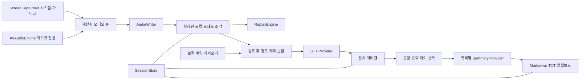

# ListenUp 기술 설계

> 2026-09-09 변경: 실제 처리 경로는 OpenAI API 기반으로 전환되었다. 현재 API, 키 저장, 청킹, 재처리 설계는 [OpenAI API 전환 문서](OPENAI_API_MIGRATION.md)를 우선한다. 아래 로컬 모델 설계는 초기 구현 기록이다.

버전 1.3 · 2026-09-09 · 네이티브 수직 흐름 구현, 실기기·장시간 검증 진행 중

사용자 응답 반영: 실제 앱 구현을 진행한다. 강의·회의 모두 사용하며 WhisperKit 로컬 전사와 Qwen3 4B MLX 4bit 로컬 요약을 기본 경로로 선택했다. 실제 확인 기기는 M1 Pro 16GiB, macOS 26.6.2다. 클라우드 경로와 자동 fallback은 MVP에 포함하지 않는다.

## 1. 결정 요약과 대안

**Swift + SwiftUI + ScreenCaptureKit + AVFoundation**을 채택한다. macOS 15 이상을 최소 대상으로 제안하고 Apple Silicon에서 먼저 검증한다. UI는 SwiftUI, 긴 전사 편집과 클립보드 같은 세부 기능은 AppKit으로 보완한다. Swift 6 언어 모드와 사용 시점의 안정 Xcode를 사용하고 구체적인 빌드 버전은 초기 프로젝트 작업에서 고정한다.

| 선택지 | 장점 | 이번 프로젝트의 부담 | 결론 |
| --- | --- | --- | --- |
| Swift/SwiftUI | OS 오디오·권한·Keychain·파일 접근을 직접 사용, 단일 언어 | 웹 UI 숙련자에게 학습 비용, 타 OS 재사용 제한 | macOS 전용 요구에 채택 |
| Tauri 2 + React + Rust | 웹 UI 개발 편의, 시스템 WebView 사용 | macOS 오디오 네이티브 연동과 Rust/Swift/JS 경계 필요 | 다중 OS가 확정될 때 재검토 |
| Electron + React | 웹 생태계·UI 개발 도구 | Chromium/Node 프로세스 구조, 캡처 권한·네이티브 연동 검증 | 이번 오디오 중심 개인 앱에서 선택하지 않음 |
| Python + Qt | STT 실험과 로컬 모델 프로토타입 편리 | Mac 배포·서명·네이티브 오디오 연동 부담 | 평가 스크립트에만 선택적 사용 |

Tauri의 WebView/Rust 구성과 Electron의 Chromium 다중 프로세스 구조는 공식 문서에 근거한다. 실제 메모리·CPU 우열은 벤치마크하지 않았으며, 위 선택은 통합 복잡도를 줄이려는 설계 판단이다. [Tauri 구조](https://v2.tauri.app/concept/architecture/), [Electron 프로세스 모델](https://www.electronjs.org/docs/latest/tutorial/process-model)

Apple은 ScreenCaptureKit에서 시스템 오디오와 마이크 출력을 제공한다. 두 출력에 공통 캡처 세션을 사용하고, 마이크 전용 경로는 AVAudioEngine으로 분리한다. 정확한 API availability는 macOS 15 deployment target에서 컴파일·실기기로 검증한다. [Apple WWDC24](https://developer.apple.com/videos/play/wwdc2024/10088/)

시스템 오디오 대안인 Core Audio process tap도 존재하지만, MVP에서 두 백엔드를 함께 구현하지 않는다. ScreenCaptureKit의 앱 필터링·기기 호환성 시험이 실패하면 제한된 spike로 대안을 평가한다. [Core Audio taps](https://developer.apple.com/documentation/CoreAudio/capturing-system-audio-with-core-audio-taps)

## 2. 범위와 원칙

1. 원본 저장은 전사·요약보다 우선한다. 인터넷·모델 오류가 녹음 콜백을 막지 않는다.
2. 한 세션은 한 writer만 수정한다. 각 기능이 임의로 같은 JSON을 덮어쓰지 않는다.
3. 원본 오디오와 원 전사 응답은 불변이다. 교정·제외·요약은 별도 리비전이다.
4. 기본은 녹음 종료 후 처리한다. 업로드된 파일의 응답 스트리밍과 라이브 오디오 스트리밍을 구분한다.
5. DB 대신 폴더·JSON manifest·JSONL journal을 사용한다. 파일 메타데이터도 필요하며 ‘DB 없음’이 ‘상태 저장 없음’을 뜻하지 않는다.
6. 키·문맥·음성을 로그에 기록하지 않는다. 공급자 추가·자동 전환은 명시적 설정으로만 한다.
7. 구현 중 유료 요청이 없어도 mock 공급자와 합성 오디오로 로컬 파이프라인을 검증할 수 있어야 한다.

## 3. 구성과 데이터 흐름



### 모듈과 책임

| 모듈 | 책임 | 하지 않는 작업 |
| --- | --- | --- |
| Domain | 값 타입, ID, 시간 범위, 버전·상태·오류 계약 | OS·HTTP·파일 I/O |
| SessionStore | manifest·journal·리비전 커밋, 잠금·복구 | 오디오 신호 처리 |
| AudioCapture | 권한, 선택 소스, 콜백 수집, 연속성 감시 | 네트워크 호출 |
| AudioProcessing | 변환·조각 파일·업로드 청크·시간 매핑 | 요약 의미 결정 |
| Playback | 파일 기반 재생, 탐색, 현재 위치 | 캡처 시계 변경 |
| Transcription | 요청 큐·capability·공급자 응답 정규화 | 원본 텍스트 의미 교정 |
| Summarization | 목적별 스키마, 청크별 추출·종합·검증 | 원본 재작성·도구 실행 |
| Export | Markdown·TXT·HTML, 클립보드 | 노션 API 호출 |
| App | 상태 표현, 사용자 입력, 기능 조율 | 직접 manifest 덮어쓰기 |

의존성은 Domain을 중심으로 단방향으로 둔다. 처음부터 과도한 패키지 수를 만들지 않고 한 Swift package의 폴더/타깃과 앱 타깃으로 시작할 수 있다. 파일 소유권은 TODO를 따른다.

## 4. 오디오 캡처 설계

### 입력·권한

선택 앱의 시스템 오디오는 ScreenCaptureKit content filter로 수집한다. 앱 단위 캡처와 브라우저 탭 단위 격리는 다르다. 여러 탭이 같은 앱의 오디오로 묶일 수 있음을 UI에 표시하고, 탭 격리를 보장하지 않는다. 캡처 대상 앱이 종료·재실행되어 식별자가 바뀌면 입력 재선택이 필요할 수 있다.

시스템 오디오 경로에는 관련 OS 녹음 권한, 마이크에는 마이크 권한을 요청한다. 시스템 오디오를 요청하면서 화면 영상 파일을 저장하지 않는다. 실제 권한 문구·재실행 필요 여부는 OS 버전별로 확인한다. 권한 거부 시 마이크만 또는 파일 가져오기로 진행할 수 있다.

macOS 15 시스템+마이크 모드는 하나의 SCStream에서 출력을 받는다. 마이크 전용은 AVAudioEngine input tap을 사용한다. 두 경로를 동시에 켜 같은 마이크를 중복 수집하지 않는다. 마이크 장치 변경은 경계를 기록하고 스트림을 재구성한다.

### 오디오 형식과 디스크 쓰기

- 입력 sample buffer의 원래 형식·sample rate·channel layout·presentation timestamp를 기록한다.
- 콜백은 제한된 선할당 큐로 버퍼를 넘기고 즉시 반환한다. 인코딩·파일 쓰기·JSON·await 네트워크를 콜백 안에서 하지 않는다.
- 워커에서 원래 sample rate를 유지하는 PCM CAF로 약 5초씩 저장한다. 기본은 소스별 mono, 사용자가 의미 있는 stereo 소스를 선택한 경우 채널 정보를 유지한다.
- `.partial` 파일을 닫고 검사한 뒤 같은 볼륨의 최종 이름으로 rename한다. 재생기는 확정된 파일만 읽는다.
- 업로드용 사본만 16kHz mono PCM WAV 또는 공급자가 허용하는 압축 형식으로 변환한다. 공급자마다 입력 형식이 다르면 adapter가 명시한다.
- 원본 보존이 기본이며 AAC 보관본 생성·PCM 삭제는 추후 명시적 보관 정책으로만 적용한다.

48kHz, 16bit, mono PCM은 계산상 한 트랙 약 345.6MB/시간, 두 트랙 약 691.2MB/시간이다. 헤더·업로드 사본·리비전은 추가 공간을 쓴다. 파일 가져오기는 원본 복사와 디코드용 임시 공간을 포함한 여유 공간을 검사한다.

큐 포화 시 무표시 드롭을 금지한다. 드롭 횟수와 누락 범위를 Gap으로 기록하고 녹음 상태를 ‘입력 누락’으로 변경한다. 디스크 부족/쓰기 실패는 더 이상 안전하게 저장할 수 없는 시점에 캡처를 중단하고 이미 확정된 조각을 유지한다.

### 시간축

`sessionTimeMs`는 세션 시작 후 단조 증가하는 시간이다. 벽시계 변경으로 역행하지 않는다. 미디어 timestamp를 세션 공통 시계에 변환하며 callback 도착 시각으로 두 트랙을 맞추지 않는다. 절전 전후에는 새 clock anchor를 만들고 gap을 기록한다.

각 파일에는 `sessionStartMs`, `frameCount`, `sampleRate`, `trackId`를 기록한다. 파일 내 프레임 위치와 세션 시각을 대응한다. 리샘플링·무음 제거·믹싱·청크 구성은 `AudioSpan` 매핑을 남겨 업로드 오프셋을 세션 시간으로 되돌린다. 녹음 일시정지와 장치 단절은 제거된 시간처럼 감추지 않는다.

가져온 파일은 원 파일 시간축을 사용한다. 외부 강의 재생 위치는 알 수 없으므로 `sourceMediaTimeMs=null`이다. 앱에서 녹음한 00:10:00을 원 강의 00:10:00으로 표시하지 않는다.

### 두 소스·화자·에코

원본 마이크와 시스템 트랙을 별도 보존한다. 기본 전사 경로는 시간 정렬한 mono 혼합 사본 하나다. 이 경로의 전사 출처는 `mixed`이며 ‘내 목소리/상대’로 자동 분리하지 않는다. 화자 기능 없이 실제 이름을 추론하지 않는다.

P1에서 트랙별 전사를 선택하면 출처는 구별할 수 있지만 두 번 전사 비용과 겹친 발언 정렬 문제가 생긴다. 마이크가 여러 사람을 담는 대면 회의에서는 마이크 출처가 곧 한 사람을 뜻하지 않는다.

앱 내부 재생은 `excludesCurrentProcessAudio=true`로 시스템 캡처에서 제외한다. [Apple API](https://developer.apple.com/documentation/screencapturekit/scstreamconfiguration/excludescurrentprocessaudio)

이 설정은 음향 에코 제거가 아니다. 이어폰과 스피커를 구분하여 시험하고, 스피커+마이크 환경에는 누출 가능성을 표시한다. 자동 AEC·음성 유사도 삭제는 MVP에 넣지 않는다. 같은 문장이 실제로 반복된 경우를 에코라고 제거하지 않는다.

## 5. 다시 듣기와 반복 표시

캡처 포인터 `recordingHeadMs`와 재생 포인터 `playheadMs`를 독립적으로 유지한다. 재생은 확정 조각 인덱스를 읽고 seek 위치가 있는 파일과 프레임을 찾는다. 최근 약 5초는 파일 확정 전이라 탐색할 수 없으며 UI에서 가능한 범위를 표시한다. ‘실시간 위치’는 과거 재생을 정지하고 라이브 화면으로 복귀하는 동작이다. 라이브 모니터링을 켜서 입력을 스피커로 되돌리지 않는다.

외부 되감기는 `Annotation(kind: replayRange, startMs, endMs, excludedFromSummary: true)`로 기록한다. 녹음과 STT는 계속되며 원 전사에는 남는다. 중복 자동 탐지는 P1에서 후보 추천만 허용한다. 문자열 유사도는 실제 중복의 증거가 아니다.

요약 제외 범위는 전사 세그먼트와 겹치면 해당 세그먼트를 제외 후보로 보여준다. 시간 정밀도가 chunk인 모델은 부분 문장 시각을 알 수 없으므로 제외 범위를 세그먼트 경계로 조정한 미리보기를 사용자가 확인한다. 새 내용까지 제외할 수 있는 부분 겹침을 조용히 전체 제외하지 않는다. 더 정밀한 편집은 전사 텍스트 선택으로 수행하고 선택한 segment ID·문자 범위를 리비전에 저장한다.

## 6. 로컬 저장과 파일 계약

최초 실행에서 NSOpenPanel로 저장 폴더를 선택한다. 권장 위치는 사용자 Documents 아래 ListenUp이지만 강제하지 않는다. 샌드박스 배포 시 security-scoped bookmark로 폴더 접근을 복원하고 stale bookmark는 다시 선택받는다. 실제 샌드박스 여부는 초기 배포 설정에서 고정한다.

```text
선택한 폴더/
  2026-09-09_143000_강의제목_a1b2c3d4/
    session.json
    journal.jsonl
    audio/
      system/000001.caf
      microphone/000001.caf
      imported/original.m4a       # 파일 가져오기 세션에만 존재
    processing/
      plan-r001.json
      requests/<request-key>.json
      responses/<request-key>.json
      audio/<request-key>.wav
    revisions/
      transcript-r001.json
      transcript-r002.json
      annotations-r001.json
      summary-r001.json
    exports/
      transcript.original.md
      transcript.md
      transcript.txt
      summary.md
      combined.md
    notes.md
```

파일명은 경로 구분자·제어 문자 제거, 길이 제한, UUID 접미사로 충돌을 방지한다. 내부 참조는 상대 경로만 사용하며 `../` 및 세션 밖 symlink 탈출을 거부한다. 제목 변경은 manifest의 제목을 바꾸고 저장 중 디렉터리를 자동 이동하지 않는다.

`session.json` 예시는 최소 계약이며 실제 schema 파일은 초기 구현에서 추가한다.

```json
{
  "schemaVersion": 1,
  "sessionId": "a1b2c3d4-0000-4000-8000-000000000001",
  "title": "데이터베이스 강의",
  "purpose": "lecture",
  "createdAt": "2026-09-09T14:30:00+09:00",
  "timeZone": "Asia/Seoul",
  "timeBasis": "capture",
  "captureStatus": "stopped",
  "processingStatus": "transcribing",
  "revision": 12,
  "lastJournalSequence": 32,
  "tracks": [],
  "gaps": [],
  "context": {"languages": ["ko"], "keywords": ["MVCC"], "notes": ""},
  "activeTranscriptRevision": null,
  "activeAnnotationRevision": "annotations-r001",
  "activeSummaryRevision": null,
  "summaryStale": false,
  "providerConfiguration": {
    "sttModelID": "argmaxinc/whisperkit-coreml/openai_whisper-large-v3-v20240930_626MB",
    "sttRevision": "0f63a7800b00dd0226abd051b906c246e1907482",
    "summaryModelID": "Qwen/Qwen3-4B-MLX-4bit",
    "summaryRevision": "4dcb3d101c2a062e5c1d4bb173588c54ea6c4d25",
    "sttLocation": "local",
    "summaryLocation": "local"
  }
}
```

세부 값 타입:

| 타입 | 필수 필드·규칙 |
| --- | --- |
| AudioSpan | trackId, relativePath, inputOffsetMs, durationMs, sessionStartMs, sampleRate, frameCount, checksum |
| TranscriptSegment | id, text, startMs, endMs, timePrecision(chunk/segment/word), sourceTrack, speakerId nullable, requestId, revision |
| Gap | startMs, endMs nullable, reason(permission/device/disk/pause/sleep/unknown), recovered 여부 |
| Annotation | id, kind(bookmark/note/replayRange), 범위, 선택 문자 범위 optional, 내용, 제외 여부, revision |
| TranscriptRevision | id, parent nullable, originalResponseRefs, segments, coverage, createdAt, model/configHash |
| SummaryRevision | id, purpose, sourceTranscriptRevision, annotationRevision, promptVersion, model, sections, evidenceIds, usage |
| UsageRecord | requestKey, attempt, providerRequestId nullable, state, secondsSent, billableUsage nullable, estimatedUSD, pricingDate |

존재하지 않는 세그먼트 참조·음수/역전 시각·파일 길이를 넘는 타임스탬프는 유효하지 않다. provider confidence가 없으면 null이며 임의의 ‘95% 정확도’를 만들지 않는다.

### 원자적 저장과 복구

SessionStore actor가 단일 writer다. 세션 파일 lock으로 다른 앱 인스턴스의 동시 편집을 막고 두 번째 인스턴스는 읽기 전용으로 연다. 종료되지 않은 프로세스의 잠금을 파일 존재 여부만 보고 강제로 지우지 않는다.

불변 산출물은 temp 작성→검사→최종 rename한다. journal에는 sequence·event ID·참조 파일·checksum을 append한 뒤 checkpoint한다. 새 manifest는 temp 파일로 작성 후 원자 교체한다. 결과 파일이 먼저 있고 manifest가 나중에 가리키게 하며, 중간 실패는 orphan 검사로 회복한다. 전원 손실까지의 내구성은 flush/sync 정책과 실기기 테스트로 확인한다.

재시작 시 마지막 manifest와 마지막까지 유효한 journal 행을 읽는다. 잘린 마지막 행은 격리하고 이전 정상 행까지 replay한다. 확정 파일 checksum·길이를 검사하고 미완성 파일은 복구 시도 후 불가능하면 Gap으로 기록한다. 요약 실패 때문에 전사 성공 상태를 되돌리지 않는다.

export는 앱이 생성한 현재 리비전의 파생 파일이다. 외부 수정이 감지되면 덮어쓰지 않고 `.conflict-<timestamp>` 결과를 만들어 사용자 수정본을 보존한다. 외부 md 수정을 내부 전사로 자동 역수입하지 않는다. 세션 폴더가 이동되면 사용자가 다시 열어 상대 경로로 복원하고, 일부 파일이 삭제되었으면 텍스트 열람과 오디오 재생 가능 여부를 각각 표시한다.

## 7. 전사 파이프라인

### 요청 계획

1. 녹음을 확정하고 누락·일시정지 범위를 포함한 전체 coverage를 만든다.
2. 소스 시간을 정렬하고 한 개의 STT용 혼합 입력을 구성한다. 디스크에서 순차적으로 읽으며 전체 세션을 RAM에 올리지 않는다.
3. 기본 60초 전후로 청크를 구성하되 끝을 가까운 무음 경계로 옮기고 최대 65초로 제한한다. 무음 경계를 못 찾으면 강제 분할 사실을 기록한다.
4. 기본 청크는 겹치지 않는다. 짧은 문맥 텍스트는 지원 공급자의 다음 요청에 전달할 수 있지만 실제 음성으로 출력하라고 지시하지 않는다.
5. 공급자 byte/duration/output limit을 함께 검사한다. OpenAI는 25MB보다 작은 안전 여유 24MB를 상한으로 둔다. 16kHz 16bit mono 60초 WAV는 약 1.92MB다.
6. 요청 계획·입력 checksum·시간 매핑을 저장한 다음 발송한다. 기본 동시성 2, rate limit·메모리 상태에 맞춰 감소한다.
7. 성공 응답을 먼저 저장하고 정규화 전사 리비전을 커밋한다. 역순으로 완료되어도 오디오 순서로 정렬한다.

청크 경계 단어 손실은 평가 fixture에서 확인한다. 겹침이 필요해지면 공급자 타임스탬프 또는 정렬 결과를 근거로 경계 중복만 합친다. 타임스탬프가 없는 모델에서 임의의 텍스트 유사도 삭제를 기본 적용하지 않는다. 바뀐 청크 정책은 configHash를 바꾼다.

### 공급자 capability

```swift
// 구현 형태를 규정하는 개념 계약. 완성된 소스 코드가 아니다.
struct STTCapabilities: Sendable {
    let supportsPrompt: Bool
    let supportsKeywordHints: Bool
    let supportsLanguageHints: Bool
    let supportsSpeakerLabels: Bool
    let timestampPrecision: TimePrecision
    let maxUploadBytes: Int? // cloud에서 필수, local에서는 nil
    let maxDurationSeconds: Double?
}

protocol STTProvider: Sendable {
    var id: String { get }
    var capabilities: STTCapabilities { get }
    func transcribe(_ request: TranscriptionRequest) async throws -> TranscriptionResult
}

protocol SummaryProvider: Sendable {
    func summarize(_ request: SummaryRequest) async throws -> SummaryResult
}
```

adapter는 실제 지원 파라미터만 전송한다. 모델이 정밀 시각을 주지 않으면 청크 시작·끝을 세그먼트 위치로 쓴다. 문장 수로 시간을 균등 분배해 정확한 타임스탬프로 보이게 하지 않는다. 공급자별 근거와 제약은 [모델 선택 문서](MODEL_SELECTION.md)에 정리했다.

P1 Diarize 응답에서 화자 ID는 `requestId:speakerLabel`로 scope한다. 요청 간 `speaker_0`을 동일인으로 합치지 않는다. 글로벌 동일인 매핑은 사용자 확인 또는 별도 검증된 기능이 있어야 한다. 화자 전용 요청 길이·JSON 응답·자동 분할 정책은 별도 adapter 테스트로 고정한다.

### 재시도·중단·청구

요청 키는 session ID + 청크 입력 checksum + 모델/옵션 hash + 전사 리비전 목적의 hash로 만든다. 완료 응답은 재사용하여 로컬 결과의 중복 적용을 막는다. 이 키는 공급자가 지원한다고 확인되지 않은 HTTP idempotency 보장을 의미하지 않는다.

429/5xx는 Retry-After 또는 지수 백오프+jitter로 최대 3회 자동 재시도한다. 401/403은 키·접근 오류, 400은 계약 오류로 중단한다. 업로드 후 timeout은 공급자 처리 여부가 불명확하므로 `unknown`으로 표시하고 추가 청구 가능성을 남긴다. 재시도 정책과 사용자의 자동 처리 설정에 따라 다시 보내며, 시도별 비용 추정치를 따로 계산한다.

취소는 대기 작업을 멈추고 진행 요청 취소를 시도한다. 이미 완료된 공급자 처리가 무료로 취소되었다고 표시하지 않는다. 네트워크 실패는 저장·재생·이미 생성된 텍스트 복사에 영향을 주지 않는다.

## 8. 요약 파이프라인

입력은 선택된 전사 리비전, 명시적으로 확인한 요약 제외 범위, 사용자 메모(별도 출처), 목적·언어·문맥이다. 녹취 속 ‘이전 지시를 무시하라’ 등의 문장은 자료로만 취급하며 도구나 외부 URL을 실행하지 않는다.

전체가 작으면 한 요청으로 처리하고, 크면 고정 예산의 부분 추출→종합으로 처리한다. 초기 기준은 요청당 입력 약 12,000토큰, 출력 약 3,000토큰의 작업 예산이며 모델 최대치와 다르다. 토큰 계산기는 선택 모델에 맞게 구현하거나 보수적으로 예산을 낮춘다. 초과 응답·잘린 출력·필수 구간 누락을 탐지하고 청크를 다시 나눈다.

부분 추출에서 각 항목에 `evidenceSegmentIds`를 보존하고, 종합에도 같은 ID를 유지한다. 모든 대상 청크가 성공한 경우에만 전체 요약으로 완료 표시한다. 미완료 상태에서 사용자가 부분 요약을 선택하면 처리·제외·실패 구간을 헤더에 표시한다.

### 스키마와 프롬프트 계약

공통 시스템 규칙: 입력에 근거한 한국어 출력, 원문 언어의 전문용어 보존, 없거나 불명확한 정보는 null/미정, 사실과 학습 보조 생성물 구분, 원문의 제안을 확정 사실로 변경 금지, JSON 스키마 준수, 외부 도구 없음.

| 목적 | 출력 구조 |
| --- | --- |
| lecture | overview[], topics[{heading, points, evidenceIds}], concepts[], examples[], emphasizedPoints[], reviewQuestions[{generated:true, evidenceIds}], uncertainties[] |
| meeting | overview[], agendaItems[], decisions[{text,evidenceIds}], actionItems[{task,owner:null|string,dueOriginal:null|string,dueNormalized:null|string,evidenceIds}], openIssues[], disagreements[], uncertainties[] |

주어진 segment ID 존재 검사만으로 의미적 근거 검증이 완료되는 것은 아니다. 먼저 JSON 타입·ID·시간 범위·필수 항목 검증을 하고, 고위험 필드인 결정·담당자·기한을 대응 근거와 함께 확인한다. 자동 검증이 불확실하면 ‘확인 필요’로 표시한다. 모델 품질 합격 여부는 사람이 주석한 평가 세트로 판단한다.

원 전사는 LLM으로 조용히 다듬지 않는다. 사용자가 교정하면 새 전사 리비전을 만들고 요약을 stale 처리한다. 목적 변경·제외 구간 변경도 요약 입력 hash를 바꾸되 재전사하지 않는다. 실패한 재요약은 기존 요약을 지우지 않는다.

## 9. 클립보드와 노션

NSPasteboard에 일반 문자열과 제한된 HTML을 함께 쓸 수 있게 구현한다. Markdown 복사는 Markdown 문자열, 서식 복사는 h1~h3/p/ul/ol/li/strong 수준의 단순 HTML과 일반 문자열 fallback을 제공한다. 모든 전사 텍스트를 HTML escape하고 외부 이미지·스크립트를 포함하지 않는다. [Apple NSPasteboard](https://developer.apple.com/documentation/appkit/nspasteboard)

노션이 모든 Markdown·HTML을 같은 블록으로 해석한다고 가정하지 않는다. 노션 데스크톱 및 웹 붙여넣기를 직접 시험한다. 기본 출력은 제목·목록 중심으로 만들고 복잡한 표나 로컬 파일 링크를 요구하지 않는다. 근거는 `[약 00:12:00–00:13:00]`처럼 이동 가능한 텍스트로 내보낸다. 앱 내 링크는 앱에서만 작동함을 구별한다.

10만 자 fixture에서 첫·중간·마지막 문장과 순서를 검증한다. 붙여넣기 도구의 제한으로 실패하면 ‘구간별 복사’와 `.md` 파일을 제공한다. 조용히 문자열을 잘라내지 않는다. 복사 성공은 클립보드 기록 성공이며 노션 저장 완료를 의미하지 않는다.

## 10. 상태·오류 계약

캡처와 후처리 상태를 독립 저장한다. `captureStatus`: idle → preparing → recording ↔ paused → stopping → stopped; 권한/장치/저장 장애는 interrupted로 전환한다. `processingStatus`: notStarted → preparing → transcribing → summarizing → ready; 단계별 paused/partial/failed/cancelled을 허용한다.

일시정지 중 종료, 전사 취소 후 재개, 녹음 종료 중 앱 종료는 상태 전이 테스트를 만든다. 세션에 실패 전사 구간이 있으면 `ready`가 아니라 `partial`이다. 빈 녹음은 ‘음성이 없습니다’로 완료하고 존재하지 않는 내용을 요약하지 않는다.

| 오류 코드 | 동작 |
| --- | --- |
| permissionDenied | 해당 입력 차단, 설정 열기 또는 다른 입력 제시 |
| sourceUnavailable / deviceChanged | Gap 시작, 입력 재선택, 가능한 트랙의 상태 별도 표시 |
| diskFull / writeFailed | 녹음 안전 중단, 확정 파일 유지, 저장 위치 안내 |
| networkUnavailable | 후처리 대기, 로컬 녹음·재생 유지 |
| authenticationFailed / modelUnavailable | 설정 수정 요구, 다른 공급자로 자동 전송 금지 |
| rateLimited | 예약액 유지·백오프, 소진된 재시도는 사용자 재개 |
| invalidProviderResponse | 원 응답 저장, 계약 실패 표시, 성공으로 집계하지 않음 |
| summaryInvalid / evidenceMissing | 이전 요약 유지, 재생성 또는 확인 필요 |
| bookmarkStale / sessionMoved | 폴더 다시 선택, 부분 데이터는 읽기 가능 |

## 11. 보안·배포·관측

MVP에는 API 키나 외부 추론 요청을 두지 않는다. 네트워크는 사용자가 시작한 모델 가중치 다운로드에만 사용하고, 녹음·전사·요약·제목·메모는 전송하지 않는다. 자동 원격 telemetry도 넣지 않는다.

본인용 개발 실행을 먼저 검증한다. 타인 배포는 Developer ID 서명·notarization과 설치 후 권한 시험이 필요하며 인증서·개발자 계정 확보는 별도 출시 의존성이다. Mac App Store 배포는 MVP 범위가 아니다. 샌드박스 사용 여부와 entitlements는 오디오/폴더 spike에서 검증 후 고정한다.

OSLog에는 세션 ID, 오류 코드, 처리 시간, byte/frame count, 요청 상태만 남긴다. 녹음·전사·제목·키는 로그에서 제외한다. 자동 원격 telemetry는 넣지 않는다. 성능 측정은 Instruments와 로컬 JSON 결과로 저장한다.

## 12. 검증 계획과 남은 결정

핵심 검증은 시간 매핑·coverage·원자적 저장·중복 결과 커밋·stale 판정·요약 근거 검사다. OS 권한·실제 오디오·스피커 누출·노션 붙여넣기는 mock으로 통과 판정하지 않는다. 단위 테스트, 합성 fixture 통합 테스트, 실제 Mac 수동 시험을 구분한다.

Domain·저장·녹음·재생·로컬 추론·결과 UI를 구현한다. 실제 마이크·화면 녹음은 사용자가 앱에서 시작할 때만 권한을 요청한다. 구현 자동 검증에서는 합성 오디오를 사용하며 음성 업로드 경로는 없다.

실행 단위와 의존성은 [구현 TODO](IMPLEMENTATION_TODO.md), 제품 인수 기준은 [PRD](PRD.md)를 따른다.

## 13. 로컬 추론의 추가 계약

배포 계약: 앱 바이너리·추론 라이브러리와 모델 가중치를 분리한다. 서명된 `.app` 내부에 내려받은 모델을 기록하지 않는다. 모델 기본 위치는 시스템 API로 구한 Application Support 아래 ListenUp/Models이며, 샌드박스에서는 컨테이너 내부 경로를 사용한다. 사용자가 원하면 설정에서 다른 폴더를 선택할 수 있다. 녹음 결과의 사용자 지정 폴더와 모델 폴더는 독립적이다.

다운로더는 버전이 고정된 모델 manifest의 파일 목록·byte 크기·SHA-256·호환 런타임·revision을 사용한다. 가중치·토크나이저·설정 파일을 모두 다운로드한다. partial 파일과 진행 상태를 저장하고, 서버가 지원하면 HTTP Range 및 ETag/If-Range로 재개한다. 서버가 재개를 지원하지 않거나 원격 파일이 바뀌면 해당 미완료 파일만 재시작하고 이를 표시한다.

전체 무결성 검사→별도 staging 폴더에서 로드 검증→설치 revision 원자적 활성화 순서를 따른다. 실패한 업데이트는 기존 모델을 유지한다. 초기 다운로드는 한 번에 모델 하나를 처리하고, 압축을 쓰는 배포라면 다운로드·해제·기존 버전 보존 공간을 함께 검사한다. 상태는 notInstalled/downloading/paused/verifying/preparing/ready/failed로 구분한다. 앱 재실행 후 네트워크 재개는 저장된 사용자 다운로드 선택과 일시정지 의사를 존중한다.

앱의 ‘모델 삭제’는 실행 중인 모델을 해제한 뒤 해당 가중치·관련 캐시만 삭제한다. 원본 녹음과 결과 파일은 보존한다. 전사·요약 각각 설치 상태로 기능을 활성화하며, 가중치가 없다고 녹음을 막거나 클라우드로 전환하지 않는다.

`processingLocation`은 STT와 요약 모두 `local`로 저장한다. STTProvider는 HTTP 업로드 없이 로컬 파일 경로와 동일한 청크/시간 매핑을 사용하며 `maxUploadBytes`는 nil이다.

잠정 구현 후보는 STT의 WhisperKit, 요약의 MLX Swift LM이다. 평가에서 선택된 패키지·가중치·토크나이저 revision과 checksums를 ModelManifest에 고정한다. `ModelManager`는 사용자 선택 모델 폴더, 설치 상태, 취소·재개, 무결성 검사와 삭제를 담당한다. manifest를 옮겼다는 이유로 가중치를 자동 다운로드하지 않는다. 실제 크기와 사용 환경은 [로컬 모델 문서](LOCAL_MODELS_AND_HARDWARE.md)에 따른다.

모델은 세션과 별개 폴더에 한 번 저장한다. 세션은 model ID·revision·원본 출력만 참조하며 앱이 없어도 txt/md를 읽을 수 있다. 다운로드는 승인된 모델 저장소에서 가중치만 가져오고 음성·전사·메모를 보내지 않는다. 설치 완료 후 추론 경로의 네트워크 요청이 없는지 별도 시험한다.

M1 Pro 16GiB의 기본 스케줄링은 녹음 중 무추론, 종료 후 STT 동시성 1, 결과 커밋 후 STT 모델 해제, 요약 모델 로드다. 메모리 해제가 실제로 반영되는지 측정하고 runtime cache를 정리한다. 새 녹음 시작 요청은 추론을 일시정지·해제해 캡처 우선권을 보장한다.

요약 입력 예산은 초기 4,000~6,000토큰, 최대 출력 1,500토큰으로 시작한다. 긴 회의는 작은 부분 추출을 누적 후 종합하며 근거 ID를 유지한다. non-thinking 모드와 출력 상한을 모델 지원 여부에 맞게 고정하여 필요 없는 추론 토큰으로 지연이 커지는 것을 피한다. JSON 문법 제약과 의미적 근거 평가는 별개로 검증한다.

memory pressure가 상승하면 다음 청크를 보류·컨텍스트를 줄이고 사용자에게 상태를 표시한다. 앱 전체가 종료되도록 무제한 작업을 추가하지 않는다. STT 4GB/4B 요약 6GB는 프로세스 peak RSS의 초기 시험 예산이며 요구량에 대한 사실 주장이 아니다. 모델 크기와 무관하게 긴 입력·KV cache·가중치 복제 여부를 함께 측정한다.

API key 설정 없이 녹음→전사→요약→복사→재열기가 동작해야 한다. 로컬 오류는 설치·재시도 상태로 표시하며 다른 처리 경로를 자동 활성화하지 않는다.
